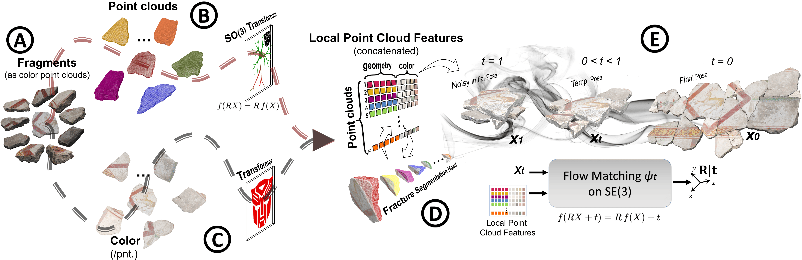

<div align="center">

# E-M3RF: An Equivariant Multimodal 3D Re-assembly Framework

[](https://em3rf.github.io/)
[](#)
[](#)

**Adeela Islam¹ ², Stefano Fiorini¹, Manuel Lecha¹ ², Theodore Tsesmelis¹,**<br>**Stuart James³, Pietro Morerio¹, Alessio Del Bue¹**

*¹ Istituto Italiano di Tecnologia  |  ² University of Genoa  |  ³ Durham University*

</div>

<br>

<div align="center">
  <!-- ⚠️ REPLACE 'assets/method_figure.png' WITH THE ACTUAL PATH TO YOUR IMAGE ⚠️ -->
  
  <br>
  <p><em>E-M3RF combines a rotation-equivariant encoder for geometry with a color transformer to predict accurate spatial transformations via SE(3) flow matching.</em></p>
</div>

---

## 🚀 Code Release

> **The official code implementation will follow soon.**

Once released, this repository will include:
- [ ] Environment setup and installation instructions
- [ ] Pre-processed datasets download scripts
- [ ] Training and evaluation code
- [ ] Pre-trained weights

---

## 📜 Citation

If you find this work useful, please consider citing our paper:

```bibtex
@article{islam2025m3rf,
  title={E-M3RF: An Equivariant Multimodal 3D Re-assembly Framework},
  author={Islam, Adeela and Fiorini, Stefano and Lecha, Manuel and Tsesmelis, Theodore and James, Stuart and Morerio, Pietro and Del Bue, Alessio},
  journal={arXiv preprint arXiv:2511.21422},
  year={2025}
}
